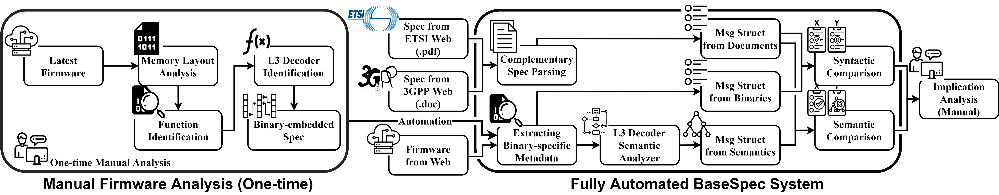

# Description
BaseSpec is a system that performs a comparative analysis of baseband
implementation and the specifications of cellular networks. The key intuition of
BaseSpec is that a message decoder in baseband software embeds the protocol
specification in a machine-friendly structure to parse incoming messages; hence,
the embedded protocol structures can be easily extracted and compared with the
specification. This enables BaseSpec to automate the comparison process and
explicitly discover mismatches in the protocol implementation, which are
non-compliant to the specification. These mismatches can directly pinpoint the
mistakes of developers when embedding the protocol structures or hint at
potential vulnerabilities.



With BaseSpec, we analyzed the implementation of cellular standard L3 messages
in 18 baseband firmware images of 9 devices models from one of the top three
vendors. BaseSpec identified hundreds of mismatches that indicate both
functional errors and potentially vulnerable points. We investigated their
functional and security implications and discovered 9 erroneous cases affecting
33 distinct messages: 5 of these cases are functional errors and 4 of them are
memory-related vulnerabilities. Notably, 2 of the vulnerabilities are critical
remote code execution (RCE) 0-days. We also applied BaseSpec to 3 models from a
different vendor in the top three. Through this analysis, BaseSpec identified
multiple mismatches, 2 of which led us to discover a buffer overflow bug.

For more details, please see [our
paper](https://syssec.kaist.ac.kr/pub/2021/kim-ndss2021.pdf).

- BaseSpec will be presented at [NDSS 2021](https://www.ndss-symposium.org/ndss-paper/basespec-comparative-analysis-of-baseband-software-and-cellular-specifications-for-l3-protocols/).


## Disclaimer
The current release of BaseSpec **only includes the parts that are irrelevant to
the vendors**: preprocessing (i.e., memory layout analysis and function
identification), complementary specification parsing, and comparison.

We reported all findings to the two vendors; one strongly refuses to publish the
details, and the other has not responded to us yet. The one that refused,
particularly, concerned that complete patch deployment would take a long time
(over six months) because they should collaborate with each mobile carrier.
According to the vendor, they should request the patches to ~280 carriers to
update ~130 models globally. Due to this complexity, the vendor thinks that
numerous devices might remain unpatched and vulnerable to our bugs. We agree
with this and anonymize the vendor in the
[paper](https://syssec.kaist.ac.kr/pub/2021/kim-ndss2021.pdf).


# How to use

### 0. Using BaseSpec in IDA Pro
BaseSpec contains python scripts based on IDA Pro APIs (IDAPython). To use
BaseSpec, first load the baseband firmware of interest into IDA Pro at the
correct locations, which may require parsing of vendor-specific firmware
file formats.
Then, import `load_ida.py` as a script file in IDA Pro (using Alt+F7).


### 1. Preprocessing
For scatter-loading, use `basespec.scatterload` as below.

```python
from basespec import scatterload
scatterload.run_scatterload()
```

For function identification, use `basespec.preprocess` as below.

```python
from basespec import preprocess
preprocess.init_functions()
preprocess.FUNC_BY_LS # identified functions by linear sweep prologue detection
preprocess.FUNC_BY_LS_TIME # time spent for linear sweep prologue detection
preprocess.FUNC_BY_PTR # identified functions by pointer analysis
preprocess.FUNC_BY_PTR_TIME # time spent for pointer analysis
```

For string initialization, use `basespec.preprocess` as below.

```python
from basespec import preprocess
preprocess.init_strings()
```


### 2. Specification parsing

You can fetch the dictionary containing all specification msgs by running as
below.

```python
from basespec import parse_spec
spec_msgs = parse_spec.get_spec_msgs() # spec_msgs[nas_type][msg_type] = ie_list
```

This `spec_msgs` dictionary contains a list of IEs for each message. Below is an
example to fetch the IE list of the EMM SECURITY MODE COMMAND message.

```python
emm_msgs = spec_msgs[7] # 7 : the type of EPS Mobility Management
smc_ie_list = emm_msgs[0x5d] # 0x5d : the type of SECURITY MODE COMMAND
```


### 3. Specification comparing

To compare the message structures in the specification and binary, you should
first create the corresponding class instances. Below is an example to compare
the IE list of the EMM ATTACH ACCEPT message
([`examples/ex_check_spec.py`](./examples/ex_check_spec.py)).

```python
from basespec.analyze_spec import check_spec
from basespec.structs.l3msg import IeInfo, L3MsgInfo, L3ProtInfo

# EMM protocol
pd = 7

# EMM attach accept message
msg_type = 0x42

# Build a message
# The information should be extracted from embedded message structures in the binary.
IE_list = []
IE_list.append(IeInfo(msg_type, name="", iei=0, min=1, max=1, imperative=True))
IE_list.append(IeInfo(msg_type, name="", iei=0, min=1, max=1, imperative=True))
IE_list.append(IeInfo(msg_type, name="", iei=0, min=1, max=1, imperative=True))
IE_list.append(IeInfo(msg_type, name="", iei=0, min=6, max=96, imperative=True))
#IE_list.append(IeInfo(msg_type, name="", iei=0, min=0, max=32767, imperative=True)) #missing
IE_list.append(IeInfo(msg_type, name="", iei=0x50, min=11, max=11, imperative=False))
IE_list.append(IeInfo(msg_type, name="", iei=0x13, min=5, max=5, imperative=False))
IE_list.append(IeInfo(msg_type, name="", iei=0x23, min=5, max=8, imperative=False))
IE_list.append(IeInfo(msg_type, name="", iei=0x53, min=1, max=1, imperative=False))
IE_list.append(IeInfo(msg_type, name="", iei=0x4A, min=1, max=99, imperative=False)) #invalid
IE_list.append(IeInfo(msg_type, name="", iei=0xFF, min=5, max=5, imperative=False)) #unknown
attach_accept_msg = L3MsgInfo(pd, msg_type, name="Attach accept", direction="DL", ie_list=IE_list)

# Build protocol
EMM_prot = L3ProtInfo(pd, [attach_accept_msg])

l3_list = [EMM_prot]

# Compare with specification
check_spec(l3_list, pd)
```

This returns the mismatch results in a CSV format. Below is a part of the output
in a CSV table format.

|IE Name|Reference|Spec IEI|Spec Presence|Spec Format|Spec Length|Bin IEI|Bin Imperative|Bin Length|Bin Idx|Error 1|Error 2|
|---|---|---|---|---|---|---|---|---|---|---|---|
|EPS attach result|EPS attach result||M|V|1/2|00|True|1|0x42|
|Spare half octet|Spare half octet||M|V|1/2|00|True|1|0x42|
|T3412 value|GPRS timer||M|V|1|00|True|1|0x42|
|TAI list|Tracking area identity list||M|LV|7-97|00|True|7-97|0x42|
|GUTI|EPS mobile identity|50|O|TLV|13|50|False|13|0x42|
|Location area identification|Location area identification|13|O|TV|6|13|False|6|0x42|
|MS identity|Mobile identity|23|O|TLV|7-10|23|False|7-10|0x42|
|EMM cause|EMM cause|53|O|TV|2|53|False|2|0x42|
|Equivalent PLMNs|PLMN list|4A|O|TLV|5-47|4A|False|3-101|0x42| non-imperative invalid mismatch (min length)| non-imperative invalid mismatch (max length)|
|-|-|-|-|-|-|FF|False|5|0x42|non-imperative unknown mismatch|
|ESM message container|ESM message container||M|LV-E|5-n|-|-|-|-|imperative missing mismatch|
|T3402 value|GPRS timer|17|O|TV|2|-|-|-|-|non-imperative missing mismatch|
|T3423 value|GPRS timer|59|O|TV|2|-|-|-|-|non-imperative missing mismatch|
| ... |


# Issues

### Tested environment
We ran all our experiments on a machine equipped with an Intel Core I7-6700K CPU
at 4.00 GHz and 64 GB DDR4 RAM. We setup Windows 10 Pro, IDA Pro v7.4, and
Python 3.7.6 on the machine.

For converting the doc and pdf files, we ran it on a Linux machine.
Please check [this function](./basespec/parse_spec.py#L15).


# Authors
This project has been conducted by the below authors at KAIST.
* [Eunsoo Kim](https://hahah.kim) (These two authors contributed equally.)
* [Dongkwan Kim](https://0xdkay.me/) (These two authors contributed equally.)
* [CheolJun Park](https://unrloay2.github.io/)
* [Insu Yun](https://insuyun.github.io/)
* [Yongdae Kim](https://syssec.kaist.ac.kr/~yongdaek/)


# Citation
We would appreciate if you consider citing [our
paper](https://syssec.kaist.ac.kr/pub/2021/kim-ndss2021.pdf).
```bibtex
@article{kim:2021:basespec,
  author = {Eunsoo Kim and Dongkwan Kim and CheolJun Park and Insu Yun and Yongdae Kim},
  title = {{BaseSpec}: Comparative Analysis of Baseband Software and Cellular Specifications for L3 Protocols},
  booktitle = {Proceedings of the 2021 Annual Network and Distributed System Security Symposium (NDSS)},
  year = 2021,
  month = feb,
  address = {Online}
}
```
